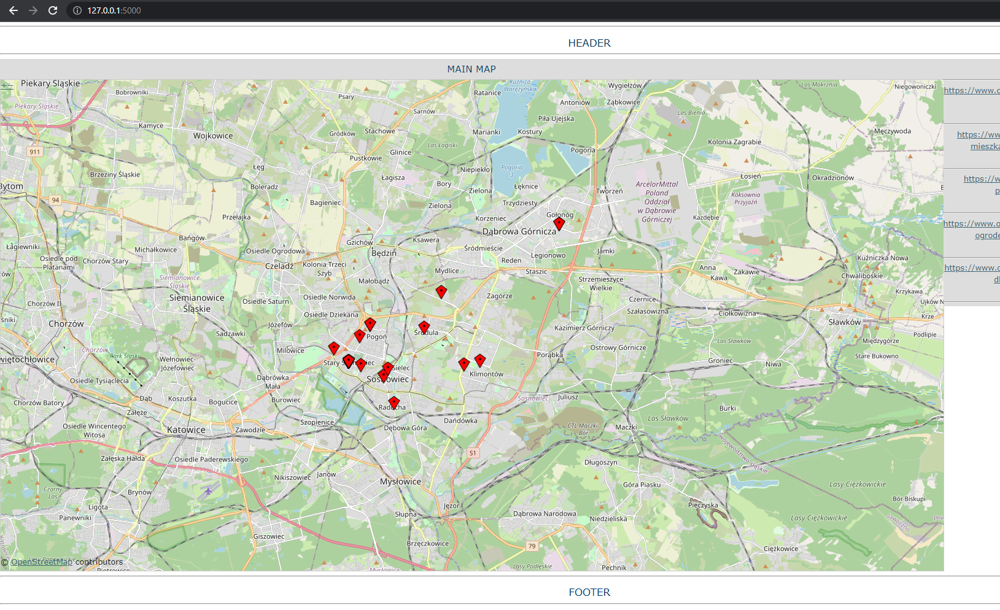
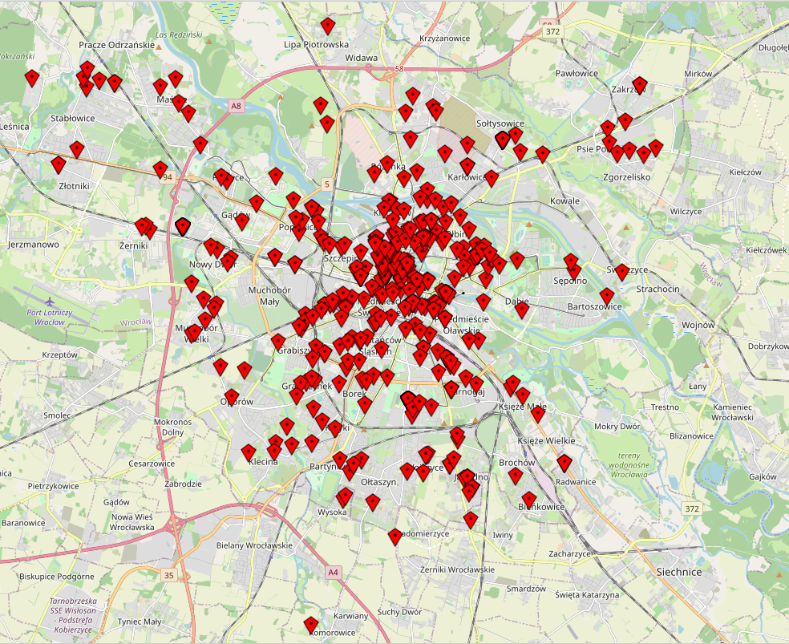

# olx-scraper
olx flats for rent advertisments scraper. For educational purposes only

## install

```
git clone https://github.com/redorb/olx-scraper
cd olx-scraper
python -m venv venv
.\venv\Scripts\Activate.ps1  # on windows
source venv/bin/activate  # on linux
```

dependencies
```
pip install -r requirements.txt
```

alternatively you can type:

```
pip install lxml requests pandas rich beautifulsoup4 Flask
```

## usage

run cli app and wait for execution

```
python olx_offers.py <olx-url>
# example
python olx_offers.py "https://www.olx.pl/d/nieruchomosci/mieszkania/wynajem/sosnowiec/?search%5Bfilter_enum_rooms%5D%5B0%5D=one"
```

run flask app

```
# https://flask.palletsprojects.com/en/1.1.x/cli/

# Unix Bash
export FLASK_APP=hello
flask run

# Windows CMD:
set FLASK_APP=app
flask run

# Windows PowerShell:
$env:FLASK_APP = "app"
flask run
```

open link in browser

```
http://127.0.0.1:5000/
```

## browser view





## few comments, QA

 - dont ask me why OpenStreetMaps files are static. I have no idea
 - don't ask me why style refers to style.css from static/theme/default. Have no idea too
 - why cli script requests each url one by one? because it was easier to develop. It could be fixed using asyncio or threading
 - can you feed olx url from browser, not from commandline? if any develop will be made I will do it
 - why there are many advertisments and only few markers on the map? because many advertisments have default location, which results of drawing them in the same point. I could think of change it to draw markers in slightly different location in such cases
 - versions 0.1.1 and above provide errors handling, keyboard interrupt and requests caching
